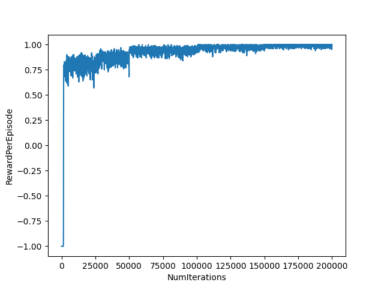
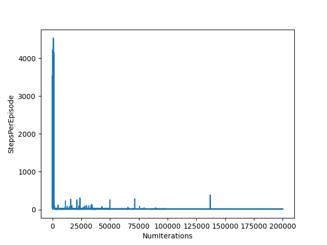
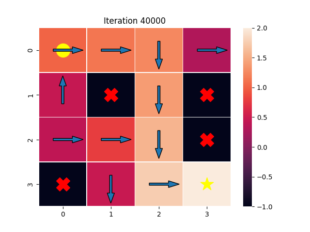
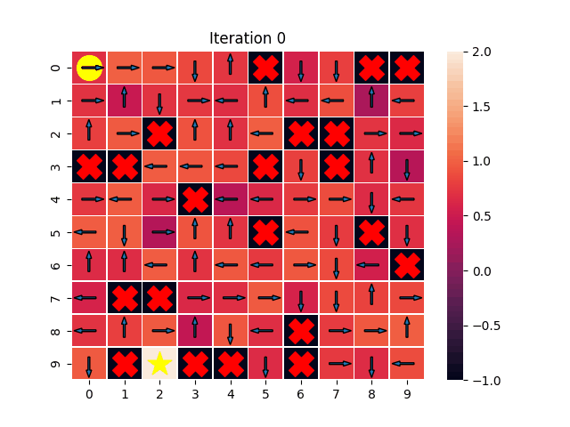

# ME5406 Project 1

## Overview

We have a robot in a 2D grid world, and this robot wants to pick up a frisbee at a particular goal location. However, the 2D grid world is on a frozen lake, with patches covered by very thin ice. If the robot walks over these patches, it will fall into the lake and die.

This repository implements 3 RL algorithms: First Visit Monte Carlo (FVMC), SARSA and Q Learning to calculate the optimal policy for this robot to navigate through the frozen lake.

## Setup

The main python script has a bunch of dependencies. These can be installed using the included [requirements.txt](requirements.txt) file

```
pip install -r requirements.txt
```

You might need to make the script executable 

```
chmod +x main.py
```

## Running the script

The main executable is [main.py](main.py). 

### Key arguments

1. **-algorithm**: Chooses the algorithm to use. Defaults to SARSA.
2. **-alpha**: Sets the learning rate (for SARSA and Q Learning). Defaults to 0.0005
3. **-gamma**: Sets the discounting factor. Defaults to 0.95
4. **-batchSize**: Sets the batch size for FVMC. Defaults to 2
5. **-width**: width of the grid. Not setting width and height results in the basic 4x4 grid initialization
6. **-height**: Height of the grid. Not setting width and height results in the basic 4x4 grid initialization
7. **-saveDir**: Where the training data is saved to. If not set, the script will create a directory with the name of the algorithm that is used, and use that
8. **-saveGridFile**: File to save the generated environment to, so the environment can be reused
8. **-gridFile**: File to load the environment from. This allows us to reuse environments across runs to test the algorithms reliably

Other arguments and their descriptions can be found by running. Adjusting their values can lead to different performances, details of which are provided in the report.

```
main.py -h
```
### Examples
If we want to use FVMC with a batch size of 10, and use the environment stored in [testEnvironment.csv](testEnvironment.csv), we run
```
main.py -algorithm FVMC -batchSize 10 -gridFile grid.csv
```
And if we want to use Q Learning in a 12x12 map with a learning rate of 0.1 and discounting factor of 0.99, and save the generated environment to the file out.csv, we run
```
main.py -algorithm Q -width 12 -height 12 -alpha 0.1 -gamma 0.99 -saveGridFile out.csv
```

## Visualization

A round of training will produce the following visualizations:

1. A graph of average reward per episode against the iteration number



2. A graph of steps per episode against the iteration number



3. Images of the Q Table at various iteration numbers. The arrow in each cell of the QTable indicates the action that has the highest QTable value. Crosses indicate the thin ice grids. The yellow circle indicates the starting position of the robot. The yellow start is the goal. The value of the best action in each state (cell position) is shown by its cell color.




4. A gif of the Q Table showing how it progresses as the iterations increase

